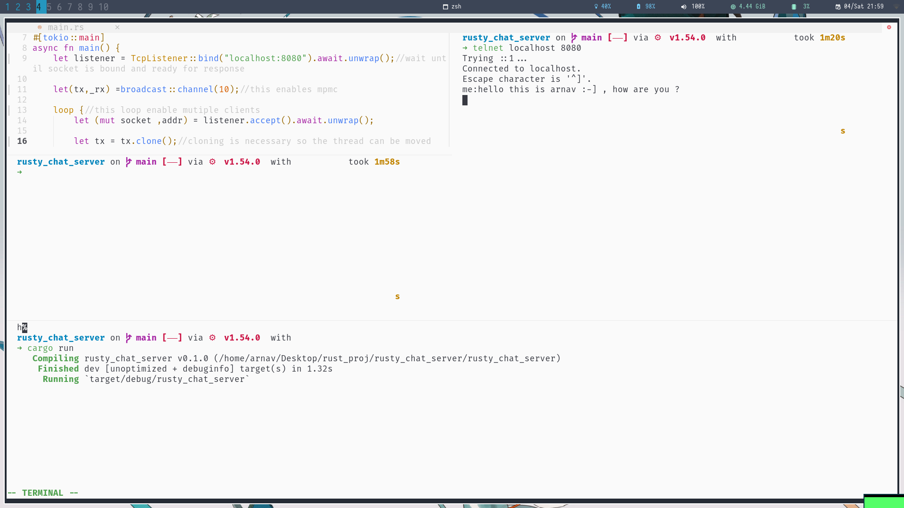
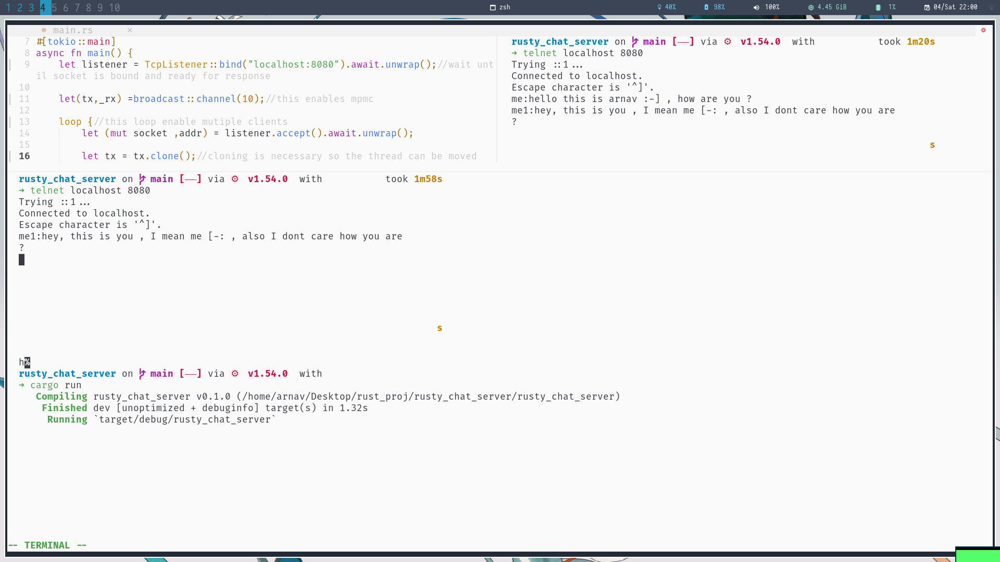
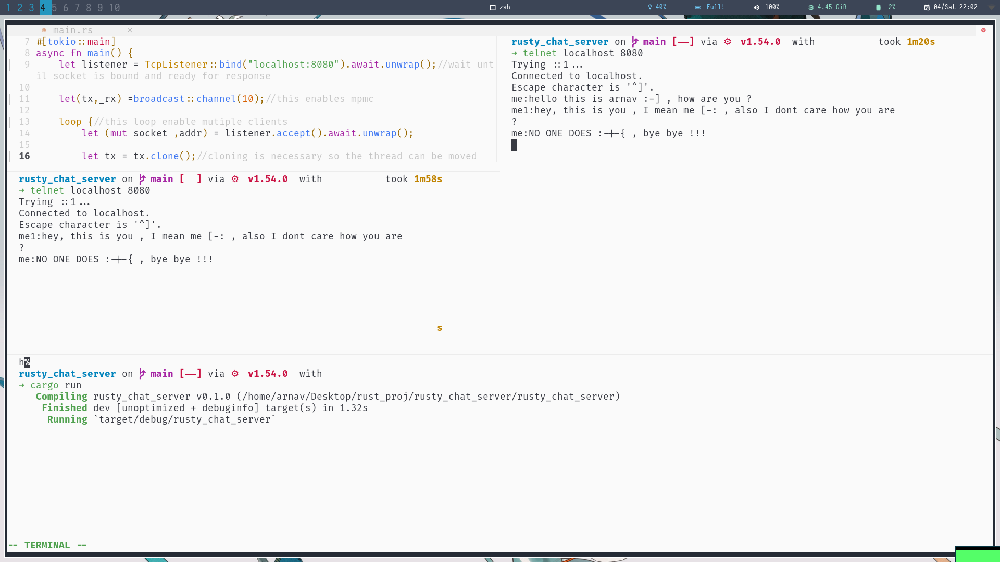

# TOKIO CHAT SERVER
## Implementing TCP chat server for N users  

### Just using Rust 🦀 , nothing special 🦞 

## Text msg no. 1 sent

## Text msg no. 2 sent and 1 recieved

## Text msg no. 3 sent and 2 recieved

